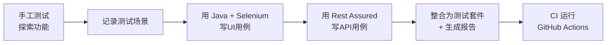

# 软件测试 + AI 应用 + Java 三线融合学习计划

## 为什么三者不是孤立的 — 核心逻辑

```
Java 开发 ──→ 你能看懂被测系统，能写自动化框架
    │
    ↓
软件测试 ──→ 当前就业目标，收入基本盘
    ↑               ↑
    │               │
AI 应用开发 ──→ 效率倍增器（AI辅助测试），也是第二增长曲线
```

**连接点一：Java 是测试自动化的主力语言**
市面上绝大多数测试自动化框架（Selenium、Appium、Rest Assured、JMeter 脚本）都用 Java。你不会因为"学测试"而丢 Java，反而在写自动化用例时大量使用 Java：集合、Lambda、Stream、多线程、设计模式（Page Object、Builder）—— 每一行自动化代码都是在练 Java。

**连接点二：AI 让测试不再枯燥**
传统的"手工点点点 + 写测试用例文档"确实无聊。但 AI 时代的测试完全不同：
- 用 AI 生成测试用例 → 本质是 prompt engineering
- 用 AI 做视觉 diff 验证 → 本质是计算机视觉应用
- 用 AI 分析日志定位 Bug → 本质是 RAG 应用
- **每条测试用例都在生产数据，这些数据可以训练 AI 模型帮你做更多事**

你的 AI 兴趣可以在测试领域找到最务实的落地场景。

**连接点三：测试经验是 AI 应用开发的"数据燃料"**
AI 应用（智能 QA 平台、自动化测试 agent）最缺的就是高质量的测试数据。你积累的测试用例、Bug 报告、自动化脚本，都是未来做 AI 产品的核心资产。

---

## 知识体系全景图

```
┌─────────────────────────────────────────────────┐
│           软 件 测 试 （主攻方向）               │
│  ┌─────────┐ ┌──────────┐ ┌──────────────────┐ │
│  │ 理论体系 │ │ 自动化    │ │ AI赋能测试       │ │
│  │ - 类型/  │ │ - Java +  │ │ - AI生成用例      │ │
│  │   分层   │ │   Selenium│ │ - 智能Bug分析     │ │
│  │ - 流程/  │ │ - API测试 │ │ - 视觉回归测试    │ │
│  │   用例   │ │ - 框架搭建│ │ - Prompt工程化    │ │
│  └─────────┘ └──────────┘ └──────────────────┘ │
├─────────────────────────────────────────────────┤
│         AI 应用开发（兴趣 + 差异化竞争力）       │
│  ┌─────────┐ ┌──────────┐ ┌──────────────────┐ │
│  │ LLM基础  │ │ 应用模式 │ │ 测试场景落地      │ │
│  │ - 原理   │ │ - RAG    │ │ - 测试用例生成器  │ │
│  │ - API   │ │ - Agent  │ │ - Bug分类机器人   │ │
│  │ - 提示词 │ │ - 工作流 │ │ - 测试报告自动    │ │
│  └─────────┘ └──────────┘ └──────────────────┘ │
├─────────────────────────────────────────────────┤
│       Java 开发（保持手感 + 面试底牌）           │
│  ┌─────────┐ ┌──────────┐ ┌──────────────────┐ │
│  │ 核心语法 │ │ 框架    │ │ 实战技能         │ │
│  │ - OOP   │ │ - Spring │ │ - SQL调优         │ │
│  │ - 集合  │ │   Boot   │ │ - Git              │ │
│  │ - 并发  │ │ - MyBatis│ │ - Linux            │ │
│  └─────────┘ └──────────┘ └──────────────────┘ │
└─────────────────────────────────────────────────┘
```

---

## 两个月实战路线图（8 周）

### 第一阶段：夯实基础 + 建立实践感（第 1-2 周）

**目标**：解决"看不下去"的问题 —— 从动手写第一个自动化用例开始，反向学理论。

#### Java 快速复习（每天 1 小时）
> 重点：面试常考 + 自动化常用

| 知识点 | 掌握程度 | 说明 |
|--------|---------|------|
| OOP 三大特性 + 多态底层 | 能讲清楚 + 手写例子 | 面试必问，自动化 Page Object 也用 |
| Collection 体系（List/Set/Map） | 源码级理解 ArrayList vs LinkedList | 自动化中大量数据操作 |
| 异常体系（checked vs unchecked） | 能设计自定义异常 | 框架中的异常处理 |
| Lambda + Stream API | 熟练使用 filter/map/collect | 写断言、数据清洗的利器 |
| 泛型 + Optional | 理解通配符 | 框架代码中大量出现 |
| 反射 + 注解 | 理解原理 | 测试框架底层机制（JUnit、TestNG） |
| 多线程基础（Thread/Runnable/线程池） | 能写简单并发 | 并发测试、性能测试基础 |

**实践项目**：写一个命令行版的 "测试用例管理器"
- 用 Collection 存储用例
- 用 Stream 做筛选/统计
- 用 Lambda 做条件过滤
- 用 Optional 做空安全处理
- 体现 OOP 设计

#### 测试理论 —— 反向切入法（每天 1.5 小时）
> 不先读书，直接动手，遇到问题再查理论

**Day 1-2 实操**：
1. 下载一个开源项目（如 [RuoYi-Vue](https://gitee.com/y_project/RuoYi-Vue) 或一个简单的 Spring Boot 应用）
2. 用 `localhost` 访问它
3. 做第一个手工测试：登录功能 → 随便点
4. **发现了什么？** —— 记录 Bug、异常、交互反馈 → 这就是"测试"

**Day 3-7 理论配对**（带着实际问题去学）：
| 你刚才做的事 | 对应理论知识点 |
|-------------|--------------|
| "我点了登录没反应" | 功能测试、冒烟测试 |
| "输入错误密码也登进去了" | 等价类划分、边界值分析 |
| "我测了三次都没问题" | 回归测试 |
| "页面加载很慢" | 性能测试（初步） |
| "Chrome 正常但 Edge 崩了" | 兼容性测试 |
| "我给开发发了截图" | Bug 报告、缺陷生命周期 |
| "我不知道还要测什么" | 测试用例设计、测试覆盖 |

**关键资源**：
- 不要通读 ISTQB 教材。去搜"软件测试面试题"，把常见问题当关键词，带着问题去学理论
- 推荐：[Testing Google](https://www.oreilly.com/library/view/how-google-tests/9780132851608/) 的前三章（谷歌怎么测试的，有故事性）

#### 本周产出
- ✅ 一个能跑的 Java 小项目（用例管理器）
- ✅ 手动测试过一个真实 Web 项目
- ✅ 理解 10+ 个测试理论术语的本质含义
- ✅ 一篇总结笔记：`测试入门第一周总结.md`

---

### 第二阶段：自动化测试入门 + 串联 Java（第 3-4 周）

**目标**：用 Java 写自动化用例，同时练 Java 又学测试。

#### 自动化体系知识清单

##### UI 自动化（Selenium + WebDriver）

```
┌─────────────────────────────────────┐
│ 自动化测试框架结构                   │
│                                      │
│  test_cases/                         │
│  ├── LoginTest.java                  │
│  ├── UserManagementTest.java         │
│  └── SearchTest.java                 │
│                                      │
│  pages/                              │
│  ├── BasePage.java     ← 封装公共操作 │
│  ├── LoginPage.java    ← 登录页元素  │
│  └── DashboardPage.java              │
│                                      │
│  utils/                              │
│  ├── DriverFactory.java  ← 浏览器驱动 │
│  ├── ConfigReader.java   ← 配置读取  │
│  └── ReportGenerator.java            │
│                                      │
│  resources/                          │
│  ├── testdata.json                   │
│  └── config.properties               │
└─────────────────────────────────────┘
```

**核心知识点路径**：
1. **定位元素**（8 种定位方式）→ 最频繁使用的技能
2. **等待机制**（implicitlyWait / WebDriverWait / FluentWait）→ 面试高频
3. **Page Object Model** → 面试高频，体现设计能力
4. **TestNG/JUnit 断言** → 自动化核心
5. **数据驱动**（Excel / JSON / YAML）→ 体现扩展性
6. **失败截图 + 报告** → 实际工作必备
7. **多浏览器支持** → 体现思考广度

##### API 自动化（Rest Assured）

| 知识点 | 自动化应用 | Java 关联 |
|--------|-----------|-----------|
| HTTP 方法语义 | GET/POST/PUT/DELETE 选择 | Spring MVC 注解也对应 |
| 请求构建 | 参数、Header、Body | Builder 模式 |
| 响应验证 | 状态码 + Body + Schema | Hamcrest Matcher |
| Token 管理 | 登录态保持 | JWT 解析 |
| 接口链式测试 | 上一个接口的输出是下个的输入 | Stream Pipeline 思维 |

##### 自动化实践项目（贯穿 2 周）

**项目**：为 [https://github.com/realworld-io](https://github.com/realworld-io) 的 Spring Boot 版构建自动化测试体系



**具体任务分解**：

| 天数 | 内容 | Java 技能收获 |
|------|------|-------------|
| 1-2 | 搭建 Selenium 项目（Maven + WebDriverManager） | 项目骨架、依赖管理 |
| 3-4 | 实现登录/注册自动化用例（Page Object） | 继承、多态设计 |
| 5 | 实现数据驱动（从 Excel 读取用户数据） | IO 流、POI 库 |
| 6-7 | 引入 Rest Assured 做 API 测试 | HTTP 交互、JSON 处理 |
| 8-9 | 实现 API + UI 混合测试（API 创建数据，UI 验证展示） | 数据流思想 |
| 10 | 集成 Allure 报告 + 失败自动截图 | 切面思维、事件监听 |
| 11-12 | 将项目推 GitHub + 配置 GitHub Actions CI | CI/CD 基础 |
| 13-14 | **复习+整理体系** → 形成自己的自动化知识导图 | 系统化思维 |

#### 这部分答成的效果
- **Java**：你用了 OOP、设计模式、集合、IO、Lambda
- **测试**：你做了真正的自动化，理解了框架
- **成果物**：一个 GitHub 公开项目，面试可以直接展示

#### 本周产出
- ✅ 一个完整的自动化测试框架项目（GitHub）
- ✅ 5+ 条自动化的 UI 用例 + 5+ 条 API 用例
- ✅ Allure 报告展示
- ✅ 一篇总结：`自动化测试框架搭建笔记.md`

---

### 第三阶段：AI 赋能测试 + AI 应用入门（第 5-6 周）

**目标**：用 AI 让测试变有趣，同时开启 AI 应用开发的大门。

#### AI 基础 —— 测试人员需要的程度

不需要懂模型训练，不需要懂数学，只需要理解：

```
你输入（Prompt）→ [大模型] → 输出（Text/JSON/Code）
                    ↑
           你不必关心内部
        把它当一个超级智能 API
```

##### AI 知识体系（面向测试人员）

| 层次 | 需要掌握 | 测试场景关联 |
|------|---------|-------------|
| LLM 是什么 | 能讲清楚 GPT 能做什么不能做什么 | 面试吹牛也能用 |
| API 调用 | 用 Java/curl 调 OpenAI API | AI 测试工具基础 |
| Prompt Engineering | 设计高质量提示词 | 生成测试用例、测试数据 |
| RAG 模式 | 从外部知识库检索 + AI 回答 | 智能 Bug 分析、知识库 |
| Agent 模式 | AI 自主决策 + 调用工具 | AI 测试 Agent |

#### 实践项目 1：AI 测试用例生成器（Day 1-3）

```
用户输入:
"登录功能，用户名 6-20 位字母数字，密码 8-16 位含特殊字符"

     ↓ [调用 LLM API]

AI 输出:
[
  { "用例1": "输入合法用户名+密码 → 登录成功" },
  { "用例2": "用户名=空 → 提示必填" },
  { "用例3": "用户名=admin' OR '1'='1 → SQL注入测试" },
  { "用例4": "密码=12345678 → 不含特殊字符 → 提示不符合规则" },
  ...
]
```

**技术栈**：Java + Spring Boot（复习Java） + OpenAI API + JSON 解析

**知识点覆盖**：
- Java HTTP 客户端调用外部 API
- JSON 序列化/反序列化（Jackson）
- Spring Boot 的 REST 接口设计
- Prompt 工程设计（few-shot、角色设定）
- 异步处理（配合同步/异步调用 AI）

#### 实践项目 2：AI Bug 分类机器人（Day 4-6）

```
输入（一条 Bug 描述）:
"用户点击提交按钮后页面无响应，F12看到500错误，
  后台日志显示NullPointerException at UserService.java:85"

     ↓ [AI 分类]

输出:
{
  "severity": "Critical",
  "category": "后端逻辑",
  "type": "空指针异常",
  "component": "UserService",
  "suggested_assignee": "后端开发组",
  "suggested_fix": "检查 user.getId() 是否可能为 null"
}
```

**技术栈**：Java + Spring Boot + AI API + RAG + 向量化（可选）

**知识点覆盖**：
- RAG 基本流程（将历史 Bug 库作为知识源）
- 结构化输出（Function Calling / Structured Output）
- Spring Boot + 数据库存储（复习 MyBatis）
- RESTful API 设计

#### 实践项目 3：AI 视觉回归测试工具（Day 7-8，选做）

用 AI 比较两张 UI 截图，智能识别变化是否算 Bug：
- 后端 Java 处理图片，调用多模态 AI
- 前端是个简单的 HTML 上传页面
- AI 判断："按钮位置移动 2px → warning" / "文案变了 → 确认是否需求变更"

#### 本周产出
- ✅ 一个 AI 测试用例生成器（GitHub）
- ✅ 一个 AI Bug 分类器（GitHub）
- ✅ 理解 LLM API 调用 + Prompt Engineering
- ✅ 一篇总结：`AI 如何改变软件测试.md`（面试差异化亮点）

---

### 第四阶段：面试冲刺 + 知识整合（第 7-8 周）

**目标**：将前 6 周的知识体系化，针对面试查漏补缺。

#### 面试知识清单

##### 软件测试面试（重点）

**基础理论（能用自己的话说）**：
- 测试金字塔 / 测试分层（能画出图并解释）
- 黑盒 vs 白盒 vs 灰盒测试
- 等价类划分、边界值分析、正交实验法、因果图法
- 冒烟测试、回归测试、集成测试、系统测试、验收测试
- Bug 生命周期 / Bug 严重级别 & 优先级
- 测试计划包含哪些内容
- 如何衡量测试覆盖率（代码覆盖率 vs 需求覆盖率）

**自动化（能结合项目讲）**：
- Selenium 原理（WebDriver 通信机制）
- 隐式等待 vs 显式等待 vs 流式等待
- Page Object 模式好处
- 如何处理弹窗 / Alert / iframe / 新窗口
- 如何做数据驱动
- CI 中怎么跑自动化测试
- 自动化用例稳定性如何保证（重试机制、等待策略、环境隔离）

**API 测试**：
- RESTful 规范
- 如何测试接口鉴权（JWT/OAuth）
- 接口测试关注哪些点（状态码、响应体、响应时间、幂等性）
- JSON Schema 校验

**性能测试（基础）**：
- JMeter 基本使用（线程组、Sampler、Listener）
- QPS / TPS / 响应时间 / 吞吐量 / P99
- 性能测试流程（基准测试 → 负载测试 → 压力测试 → 稳定性测试）
- 常见性能瓶颈定位思路（慢 SQL、缺少缓存、连接池不足）

**真实世界场景题**（面试最爱）：
> "给你一个电商的购物车功能，你怎么测试？"
> "上线前发现一个严重 Bug，但项目组要发布，怎么办？"
> "开发说'这测不出来'，你怎么回应？"
> "自动化用例经常跑挂，你怎么排查？"

**应对策略**：用 STAR 原则 + 你的实践项目来回答。
> "我在做某某项目时，遇到过类似问题。当时我……（做了什么），最后……（结果）。"

##### Java 面试（次重点）

| 知识点 | 重要程度 | 你的优势（结合测试背景） |
|--------|---------|----------------------|
| OOP 基础 + 设计模式（单例/工厂/Builder） | ⭐⭐⭐⭐⭐ | 自动化框架大量使用 |
| 集合类（HashMap 源码 / ConcurrentHashMap） | ⭐⭐⭐⭐ | 大量测试数据处理 |
| 异常体系（try-catch-final / 自定义异常） | ⭐⭐⭐⭐ | 自动化中异常处理 |
| 多线程（ThreadPoolExecutor 参数） | ⭐⭐⭐ | 并发测试场景 |
| JVM 基础（内存模型 / GC） | ⭐⭐⭐ | 性能测试必备 |
| Spring Boot 基础（IoC/AOP/REST 注解） | ⭐⭐⭐ | 测试框架对接、了解被测系统 |
| MyBatis / JPA（CRUD + 关联查询） | ⭐⭐ | 测试数据准备 |

**面试回答策略**：所有 Java 问题都尽量往测试上靠。
- "请讲讲 HashMap" → "好的，我在做自动化数据驱动时用过 HashMap 来存储测试数据，key 是用例编号，value 是测试参数集合。我还遇到过并发修改的问题，这让我去了解了 ConcurrentHashMap..."
- "请讲讲设计模式" → "在搭建自动化框架时，我大量使用了 Page Object 模式..."

##### AI 应用（差异化亮点 ⭐）

这是你和其他测试候选人的核心差异点。面试中这样展示：

> "我不仅会做自动化测试，我还利用 AI 工具提升了测试效率。我开发了一个 AI 测试用例生成器，输入功能描述就能自动生成边界覆盖用例；还有一个 Bug 分类器能自动将 Bug 分给对应开发。这些工具用 Java Spring Boot 开发，集成了 LLM API。"

一句话同时展示了：**测试思维 + Java 开发能力 + AI 应用能力**。

#### 每周冲刺安排

| 周次 | 重心 | 每日节奏 |
|------|------|---------|
| 第 7 周 | 刷面试题 + 项目复盘 | 上午：刷 20 道测试面试题 + 写答案<br>下午：完善 GitHub 项目（README、代码注释）<br>晚上：Java 面试题 10 道 |
| 第 8 周 | 模拟面试 + 查漏补缺 | 上午：录音模拟回答面试题<br>下午：根据模拟发现的问题补知识点<br>晚上：复习总结笔记 |

#### 面试作品集

到第 8 周结束时，你应该有：

```
GitHub 主页 — 面试展示用
│
├── personal-wiki/     ← 学习过程全记录（面试造梗素材库）
│
├── test-case-manager/ ← 第1周的 Java 练手项目
│
├── web-auto-test/     ← 第3-4周的自动化测试框架
│   ├── README.md      ← 框架设计思路、技术栈、运行方式
│   ├── src/test/
│   └── reports/
│
├── ai-test-case-gen/  ← 第5周的 AI 测试用例生成器
│   ├── README.md
│   ├── 效果截图.png
│   └── src/
│
└── ai-bug-classifier/ ← 第5-6周的 AI Bug 分类器
    └── ...
```

---

## 每日时间分配建议

```
工作日（周一至周五）:
┌─────────────────┐
│ 19:00 - 19:30   │ Java 刷题 / 快速复习
│ 19:30 - 21:00   │ 测试实践（写代码/做项目）
│ 21:00 - 21:30   │ AI 学习（看文档/写小工具）
│ 21:30 - 22:00   │ 整理笔记，写总结
└─────────────────┘

周末（周六至周日）:
┌─────────────────┐
│ 上午 09:00-12:00│ 集中攻坚（一整块项目）
│ 下午 14:00-17:00│ 继续项目 / 复习 / 刷题
│ 晚上 自由       │ 看技术文章，写笔记
└─────────────────┘
```

---

## 关键学习原则

1. **80/20 法则**：测试领域 80% 的日常工作只需要 20% 的知识。先掌握那 20%（自动化、用例设计、Bug 流程），其他在实践中补齐。

2. **先动手再理论**：你"看不下去"是正常的，因为纯理论没有上下文。先做项目，遇到问题再查理论，效率高 10 倍。

3. **一鱼多吃**：每个项目同时练三个领域。比如写 AI 测试用例生成器，同时在练 Java、测试思维、AI API。

4. **输出倒逼输入**：每天写一篇小总结（哪怕只是几条 bullet points）。能写出来才是真学会。

5. **面试是考试的终点**：不是学会了再去面试，而是用面试题来引导学习方向。先看 JD（职位描述），再针对性学。

---

## 配套资源推荐

### 测试
- [Testing Google](https://www.oreilly.com/library/view/how-google-tests/9780132851608/) — 讲故事的测试书，不枯燥
- [Selenium 官方文档](https://www.selenium.dev/documentation/) — 比博客准确
- [TesterHome](https://testerhome.com/) — 中文测试社区

### Java
- [JavaGuide](https://javaguide.cn/) — 面试导向的 Java 知识体系
- [CodeSheep 的 Java 速成系列](https://space.bilibili.com/384068749) — B 站，适合复习

### AI
- [吴恩达《ChatGPT Prompt Engineering for Developers》](https://www.deeplearning.ai/short-courses/chatgpt-prompt-engineering-for-developers/) — 免费，1-2 天学完
- [OpenAI API 文档](https://platform.openai.com/docs/) — 最权威
- [LangChain 入门](https://python.langchain.com/docs/get_started/introduction) — 理解 RAG 和 Agent 概念

---

## 最后：怎样才算"准备好面试"？

不是"学完所有知识"，而是：

- ✅ 能流畅讲清楚一个测试项目的完整流程（从接到需求到发布）
- ✅ 能在白板上画出自动化框架的架构图
- ✅ 能现场手撕一段 Selenium 代码
- ✅ 能说出一次真实的 Bug 排查经历（你用 AI 工具帮了忙更佳）
- ✅ 有一份可展示的 GitHub 项目
- ✅ 对"为什么从开发转测试"或"为什么同时做 AI"有自己的故事

**当你完成这六项，你就可以自信去面试了。**
